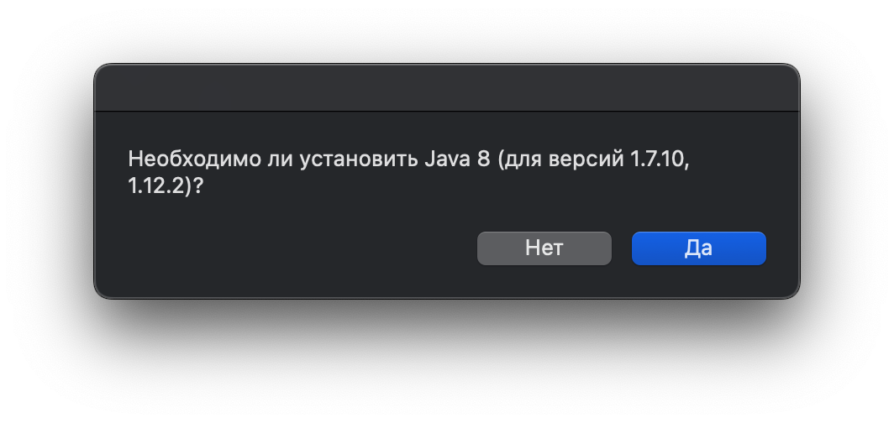

# Установщик Java 8 для Minecraft (macOS)


Автоматический установщик Java 8 для запуска Minecraft (GravityCraft) версий 1.7.10 и 1.12.2 на macOS с чипом Apple Silicon.

## ✨ Особенности
- Скачивание Amazon Corretto 8
- Автоматическая распаковка и установка
- Уведомления об успехе/ошибках
- Совместимость с Apple Silicon (через Rosetta 2)

## ⚙️ Требования
- macOS 11 или новее
- Доступ в Интернет
- Терминал для настройки разрешений
- 150 МБ свободного места

## 🛠️ Установка
1. Скачайте скрипт:
```bash
curl -O https://raw.githubusercontent.com/TheRaiwy/JGC/main/JGC.command
```
Или скачайте JGC.command из репозитория

2. Дайте права на выполнение:
```bash
chmod +x JGC.command
```

3. Запустите через Finder:
   - Двойной клик по файлу `JGC.command`
   - При предупреждении: "Системные настройки" → "Защита и безопасность" → "Все равно открыть"

## 🖥️ Использование
1. После запуска появится диалоговое окно:
   

2. При выборе "Да":
   - Автоматическая загрузка архива (≈110 МБ)
   - Распаковка во временную папку
   - Копирование в `/Users/[ваш_логин]/minecraft/GravityCraft/updates/`

3. Результат:
   - При успехе: "Java успешно установлена!"
   - При ошибках: подробное сообщение

## Гарантированная Поддержка Minecraft версий:  
✅ 1.7.10  
✅ 1.12.2  
⚠️ Тестировано на macOS 15.1 (Sequoia)

## 📜 Лицензия
MIT License. Полный текст доступен в файле [LICENSE](LICENSE).
